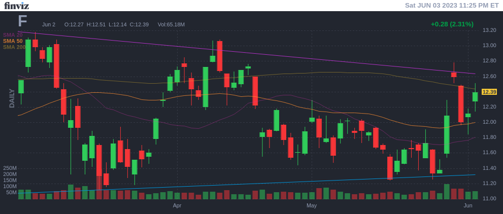
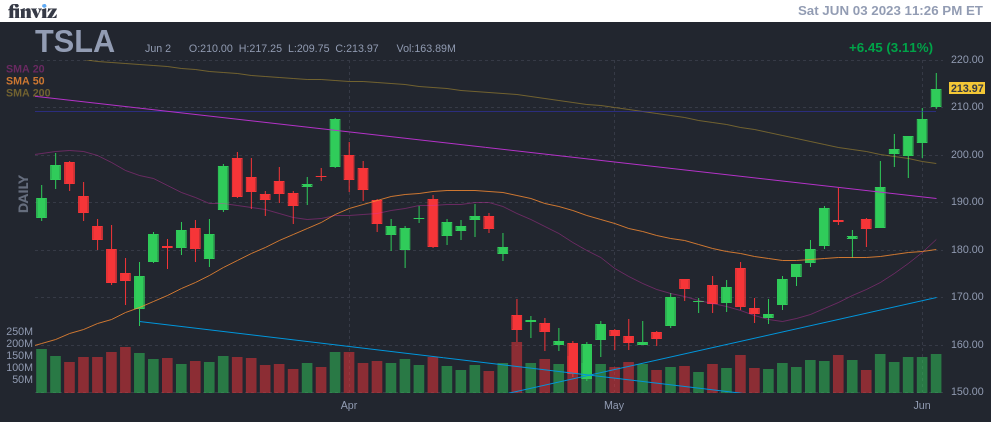
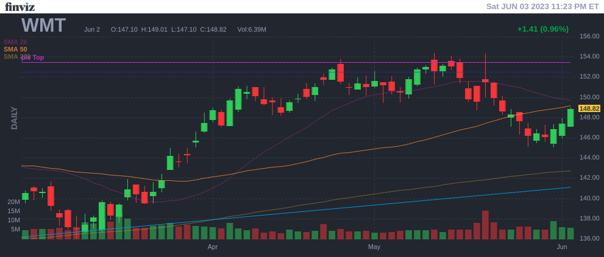

# Trend Review 2023-06-02

---

## Communications

### BIDU

|  RSI(14) | Trend | Basket |
|----------|-------|--------|
|  58.67 | sideways | Communications |

### CMCSA

|  RSI(14) | Trend | Basket |
|----------|-------|--------|
|  46.34 | downtrend | Communications |

### DIS

|  RSI(14) | Trend | Basket |
|----------|-------|--------|
|  43.5 | downtrend | Communications |

### GOOG

|  RSI(14) | Trend | Basket |
|----------|-------|--------|
|  68.14 | uptrend | Communications |

### META

|  RSI(14) | Trend | Basket |
|----------|-------|--------|
|  83.85 | uptrend | Communications |

### ROKU

|  RSI(14) | Trend | Basket |
|----------|-------|--------|
|  58.29 | downtrend | Communications |

### T

|  RSI(14) | Trend | Basket |
|----------|-------|--------|
|  28.38 | downtrend | Communications |

### VZ

|  RSI(14) | Trend | Basket |
|----------|-------|--------|
|  32.21 | downtrend | Communications |

---

## Consumer

### AMZN

|  RSI(14) | Trend | Basket |
|----------|-------|--------|
|  71.86 | uptrend | Consumer |

### BABA

|  RSI(14) | Trend | Basket |
|----------|-------|--------|
|  49.48 | downtrend | Consumer |

### BBY

|  RSI(14) | Trend | Basket |
|----------|-------|--------|
|  52.16 | downtrend | Consumer |

### BYND

|  RSI(14) | Trend | Basket |
|----------|-------|--------|
|  40.07 | downtrend | Consumer |

### CHWY

|  RSI(14) | Trend | Basket |
|----------|-------|--------|
|  59.26 | downtrend | Consumer |

### COST

|  RSI(14) | Trend | Basket |
|----------|-------|--------|
|  62.5 | uptrend | Consumer |

### CZR

|  RSI(14) | Trend | Basket |
|----------|-------|--------|
|  54.97 | downtrend | Consumer |

### DKNG

|  RSI(14) | Trend | Basket |
|----------|-------|--------|
|  63.41 | uptrend | Consumer |

### EXPE

|  RSI(14) | Trend | Basket |
|----------|-------|--------|
|  66.46 | uptrend | Consumer |

### F

|  RSI(14) | Trend | Basket |
|----------|-------|--------|
|  57.56 | downtrend | Consumer |

### GM

|  RSI(14) | Trend | Basket |
|----------|-------|--------|
|  56.75 | downtrend | Consumer |

### HD

|  RSI(14) | Trend | Basket |
|----------|-------|--------|
|  54.34 | downtrend | Consumer |

### JD

|  RSI(14) | Trend | Basket |
|----------|-------|--------|
|  50.1 | downtrend | Consumer |

### KO

|  RSI(14) | Trend | Basket |
|----------|-------|--------|
|  42.32 | downtrend | Consumer |

### KR

|  RSI(14) | Trend | Basket |
|----------|-------|--------|
|  36.89 | downtrend | Consumer |

### KSS

|  RSI(14) | Trend | Basket |
|----------|-------|--------|
|  49.98 | downtrend | Consumer |

### LOW

|  RSI(14) | Trend | Basket |
|----------|-------|--------|
|  56.67 | sideways | Consumer |

### LVS

|  RSI(14) | Trend | Basket |
|----------|-------|--------|
|  51.76 | downtrend | Consumer |

### MAR

|  RSI(14) | Trend | Basket |
|----------|-------|--------|
|  56.96 | sideways | Consumer |

### MCD

|  RSI(14) | Trend | Basket |
|----------|-------|--------|
|  50.95 | downtrend | Consumer |

### MDLZ

|  RSI(14) | Trend | Basket |
|----------|-------|--------|
|  45.97 | downtrend | Consumer |

### MGM

|  RSI(14) | Trend | Basket |
|----------|-------|--------|
|  44.85 | downtrend | Consumer |

### MO

|  RSI(14) | Trend | Basket |
|----------|-------|--------|
|  50.05 | downtrend | Consumer |

### NCLH

|  RSI(14) | Trend | Basket |
|----------|-------|--------|
|  69.05 | uptrend | Consumer |

### NKE

|  RSI(14) | Trend | Basket |
|----------|-------|--------|
|  34.24 | downtrend | Consumer |

### PEP

|  RSI(14) | Trend | Basket |
|----------|-------|--------|
|  39.7 | downtrend | Consumer |

### PG

|  RSI(14) | Trend | Basket |
|----------|-------|--------|
|  40.35 | downtrend | Consumer |

### RCL

|  RSI(14) | Trend | Basket |
|----------|-------|--------|
|  76.23 | uptrend | Consumer |

### SBUX

|  RSI(14) | Trend | Basket |
|----------|-------|--------|
|  38.07 | downtrend | Consumer |

### TGT

|  RSI(14) | Trend | Basket |
|----------|-------|--------|
|  26.0 | downtrend | Consumer |

### TJX

|  RSI(14) | Trend | Basket |
|----------|-------|--------|
|  52.48 | sideways | Consumer |

### TSLA

|  RSI(14) | Trend | Basket |
|----------|-------|--------|
|  76.32 | uptrend | Consumer |

### VFC

|  RSI(14) | Trend | Basket |
|----------|-------|--------|
|  38.07 | downtrend | Consumer |

### WMT

|  RSI(14) | Trend | Basket |
|----------|-------|--------|
|  49.5 | downtrend | Consumer |

### XLP

|  RSI(14) | Trend | Basket |
|----------|-------|--------|
|  39.07 | downtrend | Consumer |

### XLY

|  RSI(14) | Trend | Basket |
|----------|-------|--------|
|  68.24 | uptrend | Consumer |

### XRT

|  RSI(14) | Trend | Basket |
|----------|-------|--------|
|  47.89 | downtrend | Consumer |

---

## Energy

### APA

|  RSI(14) | Trend | Basket |
|----------|-------|--------|
|  49.2 | downtrend | Energy |

### BP

|  RSI(14) | Trend | Basket |
|----------|-------|--------|
|  45.05 | downtrend | Energy |

### COP

|  RSI(14) | Trend | Basket |
|----------|-------|--------|
|  52.43 | downtrend | Energy |

### CVX

|  RSI(14) | Trend | Basket |
|----------|-------|--------|
|  48.05 | downtrend | Energy |

### DVN

|  RSI(14) | Trend | Basket |
|----------|-------|--------|
|  47.99 | downtrend | Energy |

### HAL

|  RSI(14) | Trend | Basket |
|----------|-------|--------|
|  56.35 | sideways | Energy |

### KMI

|  RSI(14) | Trend | Basket |
|----------|-------|--------|
|  52.92 | downtrend | Energy |

### MPC

|  RSI(14) | Trend | Basket |
|----------|-------|--------|
|  42.83 | downtrend | Energy |

### MRO

|  RSI(14) | Trend | Basket |
|----------|-------|--------|
|  50.69 | downtrend | Energy |

### OXY

|  RSI(14) | Trend | Basket |
|----------|-------|--------|
|  51.81 | downtrend | Energy |

### RIG

|  RSI(14) | Trend | Basket |
|----------|-------|--------|
|  58.86 | sideways | Energy |

### SLB

|  RSI(14) | Trend | Basket |
|----------|-------|--------|
|  53.06 | downtrend | Energy |

### USO

|  RSI(14) | Trend | Basket |
|----------|-------|--------|
|  49.8 | downtrend | Energy |

### XLE

|  RSI(14) | Trend | Basket |
|----------|-------|--------|
|  49.99 | downtrend | Energy |

### XOM

|  RSI(14) | Trend | Basket |
|----------|-------|--------|
|  46.6 | downtrend | Energy |

### XOP

|  RSI(14) | Trend | Basket |
|----------|-------|--------|
|  52.4 | downtrend | Energy |

---

## Finance

### AIG

|  RSI(14) | Trend | Basket |
|----------|-------|--------|
|  57.79 | uptrend | Finance |

### AXP

|  RSI(14) | Trend | Basket |
|----------|-------|--------|
|  68.98 | uptrend | Finance |

### BAC

|  RSI(14) | Trend | Basket |
|----------|-------|--------|
|  54.56 | downtrend | Finance |

### BX

|  RSI(14) | Trend | Basket |
|----------|-------|--------|
|  61.64 | downtrend | Finance |

### C

|  RSI(14) | Trend | Basket |
|----------|-------|--------|
|  52.99 | downtrend | Finance |

### COF

|  RSI(14) | Trend | Basket |
|----------|-------|--------|
|  73.13 | uptrend | Finance |

### FITB

|  RSI(14) | Trend | Basket |
|----------|-------|--------|
|  54.35 | downtrend | Finance |

### GS

|  RSI(14) | Trend | Basket |
|----------|-------|--------|
|  47.37 | downtrend | Finance |

### JPM

|  RSI(14) | Trend | Basket |
|----------|-------|--------|
|  59.46 | sideways | Finance |

### KRE

|  RSI(14) | Trend | Basket |
|----------|-------|--------|
|  58.1 | downtrend | Finance |

### MET

|  RSI(14) | Trend | Basket |
|----------|-------|--------|
|  48.64 | downtrend | Finance |

### MS

|  RSI(14) | Trend | Basket |
|----------|-------|--------|
|  50.9 | sideways | Finance |

### PNC

|  RSI(14) | Trend | Basket |
|----------|-------|--------|
|  56.66 | downtrend | Finance |

### PYPL

|  RSI(14) | Trend | Basket |
|----------|-------|--------|
|  46.12 | downtrend | Finance |

### SCHW

|  RSI(14) | Trend | Basket |
|----------|-------|--------|
|  58.53 | sideways | Finance |

### USB

|  RSI(14) | Trend | Basket |
|----------|-------|--------|
|  52.9 | sideways | Finance |

### V

|  RSI(14) | Trend | Basket |
|----------|-------|--------|
|  51.75 | downtrend | Finance |

### VXX

|  RSI(14) | Trend | Basket |
|----------|-------|--------|
|  29.86 | downtrend | Finance |

### WFC

|  RSI(14) | Trend | Basket |
|----------|-------|--------|
|  57.56 | downtrend | Finance |

### XLF

|  RSI(14) | Trend | Basket |
|----------|-------|--------|
|  56.39 | downtrend | Finance |

---

## Health

### ABBV

|  RSI(14) | Trend | Basket |
|----------|-------|--------|
|  33.43 | downtrend | Health |

### ABT

|  RSI(14) | Trend | Basket |
|----------|-------|--------|
|  42.32 | downtrend | Health |

### CVS

|  RSI(14) | Trend | Basket |
|----------|-------|--------|
|  49.95 | downtrend | Health |

### JNJ

|  RSI(14) | Trend | Basket |
|----------|-------|--------|
|  44.49 | downtrend | Health |

### MRK

|  RSI(14) | Trend | Basket |
|----------|-------|--------|
|  46.14 | downtrend | Health |

### MRNA

|  RSI(14) | Trend | Basket |
|----------|-------|--------|
|  47.9 | sideways | Health |

### PFE

|  RSI(14) | Trend | Basket |
|----------|-------|--------|
|  50.24 | downtrend | Health |

### WBA

|  RSI(14) | Trend | Basket |
|----------|-------|--------|
|  45.04 | downtrend | Health |

### XBI

|  RSI(14) | Trend | Basket |
|----------|-------|--------|
|  56.95 | sideways | Health |

---

## Industrial

### AAL

|  RSI(14) | Trend | Basket |
|----------|-------|--------|
|  58.79 | uptrend | Industrial |

### BA

|  RSI(14) | Trend | Basket |
|----------|-------|--------|
|  64.25 | sideways | Industrial |

### CAT

|  RSI(14) | Trend | Basket |
|----------|-------|--------|
|  63.85 | downtrend | Industrial |

### DAL

|  RSI(14) | Trend | Basket |
|----------|-------|--------|
|  64.93 | uptrend | Industrial |

### DE

|  RSI(14) | Trend | Basket |
|----------|-------|--------|
|  52.41 | downtrend | Industrial |

### FDX

|  RSI(14) | Trend | Basket |
|----------|-------|--------|
|  45.59 | downtrend | Industrial |

### GE

|  RSI(14) | Trend | Basket |
|----------|-------|--------|
|  64.87 | uptrend | Industrial |

### LUV

|  RSI(14) | Trend | Basket |
|----------|-------|--------|
|  51.68 | sideways | Industrial |

### UAL

|  RSI(14) | Trend | Basket |
|----------|-------|--------|
|  61.7 | uptrend | Industrial |

### UPS

|  RSI(14) | Trend | Basket |
|----------|-------|--------|
|  43.81 | sideways | Industrial |

### XHB

|  RSI(14) | Trend | Basket |
|----------|-------|--------|
|  61.06 | sideways | Industrial |

---

## International

### EEM

|  RSI(14) | Trend | Basket |
|----------|-------|--------|
|  56.59 | downtrend | International |

### EFA

|  RSI(14) | Trend | Basket |
|----------|-------|--------|
|  51.26 | downtrend | International |

### EWZ

|  RSI(14) | Trend | Basket |
|----------|-------|--------|
|  62.92 | sideways | International |

### FXI

|  RSI(14) | Trend | Basket |
|----------|-------|--------|
|  48.26 | downtrend | International |

---

## Materials

### CF

|  RSI(14) | Trend | Basket |
|----------|-------|--------|
|  37.97 | downtrend | Materials |

### CLF

|  RSI(14) | Trend | Basket |
|----------|-------|--------|
|  50.2 | downtrend | Materials |

### DOW

|  RSI(14) | Trend | Basket |
|----------|-------|--------|
|  48.34 | downtrend | Materials |

### FCX

|  RSI(14) | Trend | Basket |
|----------|-------|--------|
|  55.73 | sideways | Materials |

### MOS

|  RSI(14) | Trend | Basket |
|----------|-------|--------|
|  30.85 | downtrend | Materials |

### NEM

|  RSI(14) | Trend | Basket |
|----------|-------|--------|
|  38.6 | downtrend | Materials |

### X

|  RSI(14) | Trend | Basket |
|----------|-------|--------|
|  48.15 | downtrend | Materials |

### XLB

|  RSI(14) | Trend | Basket |
|----------|-------|--------|
|  53.54 | downtrend | Materials |

---

## Precious Metals

### GDX

|  RSI(14) | Trend | Basket |
|----------|-------|--------|
|  42.96 | downtrend | Precious Metals |

### GLD

|  RSI(14) | Trend | Basket |
|----------|-------|--------|
|  41.71 | downtrend | Precious Metals |

### GOLD

|  RSI(14) | Trend | Basket |
|----------|-------|--------|
|  36.94 | downtrend | Precious Metals |

### SLV

|  RSI(14) | Trend | Basket |
|----------|-------|--------|
|  45.41 | downtrend | Precious Metals |

---

## Real Estate

### IYR

|  RSI(14) | Trend | Basket |
|----------|-------|--------|
|  55.77 | downtrend | Real Estate |

---

## Technology

### AAPL

|  RSI(14) | Trend | Basket |
|----------|-------|--------|
|  72.63 | uptrend | Technology |

### ADBE

|  RSI(14) | Trend | Basket |
|----------|-------|--------|
|  78.54 | uptrend | Technology |

### AMAT

|  RSI(14) | Trend | Basket |
|----------|-------|--------|
|  66.59 | uptrend | Technology |

### AMD

|  RSI(14) | Trend | Basket |
|----------|-------|--------|
|  65.23 | uptrend | Technology |

### ARKK

|  RSI(14) | Trend | Basket |
|----------|-------|--------|
|  64.22 | uptrend | Technology |

### AVGO

|  RSI(14) | Trend | Basket |
|----------|-------|--------|
|  78.41 | uptrend | Technology |

### CRM

|  RSI(14) | Trend | Basket |
|----------|-------|--------|
|  58.07 | uptrend | Technology |

### CRWD

|  RSI(14) | Trend | Basket |
|----------|-------|--------|
|  61.0 | uptrend | Technology |

### CSCO

|  RSI(14) | Trend | Basket |
|----------|-------|--------|
|  63.03 | uptrend | Technology |

### DOCU

|  RSI(14) | Trend | Basket |
|----------|-------|--------|
|  67.03 | uptrend | Technology |

### FSLR

|  RSI(14) | Trend | Basket |
|----------|-------|--------|
|  54.66 | uptrend | Technology |

### HPQ

|  RSI(14) | Trend | Basket |
|----------|-------|--------|
|  53.59 | uptrend | Technology |

### IBM

|  RSI(14) | Trend | Basket |
|----------|-------|--------|
|  67.81 | uptrend | Technology |

### INTC

|  RSI(14) | Trend | Basket |
|----------|-------|--------|
|  57.2 | downtrend | Technology |

### MRVL

|  RSI(14) | Trend | Basket |
|----------|-------|--------|
|  70.2 | sideways | Technology |

### MSFT

|  RSI(14) | Trend | Basket |
|----------|-------|--------|
|  71.82 | uptrend | Technology |

### NET

|  RSI(14) | Trend | Basket |
|----------|-------|--------|
|  75.08 | uptrend | Technology |

### NFLX

|  RSI(14) | Trend | Basket |
|----------|-------|--------|
|  72.56 | uptrend | Technology |

### NVDA

|  RSI(14) | Trend | Basket |
|----------|-------|--------|
|  73.57 | uptrend | Technology |

### ORCL

|  RSI(14) | Trend | Basket |
|----------|-------|--------|
|  71.35 | uptrend | Technology |

### QCOM

|  RSI(14) | Trend | Basket |
|----------|-------|--------|
|  59.08 | downtrend | Technology |

### QQQ

|  RSI(14) | Trend | Basket |
|----------|-------|--------|
|  75.92 | uptrend | Technology |

### SHOP

|  RSI(14) | Trend | Basket |
|----------|-------|--------|
|  54.25 | downtrend | Technology |

### SMH

|  RSI(14) | Trend | Basket |
|----------|-------|--------|
|  70.5 | uptrend | Technology |

### SQ

|  RSI(14) | Trend | Basket |
|----------|-------|--------|
|  58.64 | downtrend | Technology |

### TSM

|  RSI(14) | Trend | Basket |
|----------|-------|--------|
|  65.54 | uptrend | Technology |

### TTD

|  RSI(14) | Trend | Basket |
|----------|-------|--------|
|  74.38 | uptrend | Technology |

### TXN

|  RSI(14) | Trend | Basket |
|----------|-------|--------|
|  58.66 | uptrend | Technology |

### UBER

|  RSI(14) | Trend | Basket |
|----------|-------|--------|
|  66.34 | sideways | Technology |

### XLK

|  RSI(14) | Trend | Basket |
|----------|-------|--------|
|  74.17 | uptrend | Technology |

---

## US Bonds

### HYG

|  RSI(14) | Trend | Basket |
|----------|-------|--------|
|  53.54 | downtrend | US Bonds |

### LQD

|  RSI(14) | Trend | Basket |
|----------|-------|--------|
|  47.1 | downtrend | US Bonds |

### TLT

|  RSI(14) | Trend | Basket |
|----------|-------|--------|
|  45.39 | downtrend | US Bonds |

---

## US Stocks

### DIA

|  RSI(14) | Trend | Basket |
|----------|-------|--------|
|  58.98 | sideways | US Stocks |

### IWM

|  RSI(14) | Trend | Basket |
|----------|-------|--------|
|  62.28 | sideways | US Stocks |

### SPY

|  RSI(14) | Trend | Basket |
|----------|-------|--------|
|  66.46 | uptrend | US Stocks |

---

## Utilities

### XLU

|  RSI(14) | Trend | Basket |
|----------|-------|--------|
|  37.88 | downtrend | Utilities |

